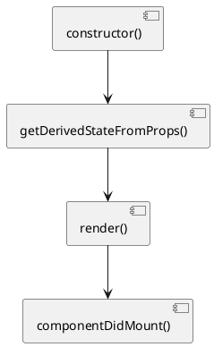
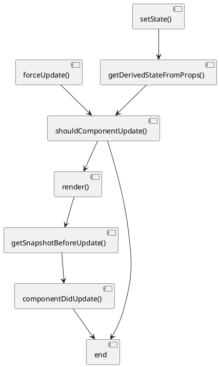
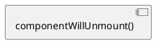
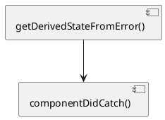
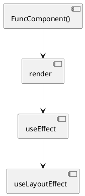

#Классовый жизненный цикл
### Монтирование

```plantuml
@startuml

component "constructor()" as constructor
component "componentDidMount()" as componentDidMount
component "getDerivedStateFromProps()" as getDerivedStateFromProps
component "render()" as render

constructor --> getDerivedStateFromProps
getDerivedStateFromProps --> render
render --> componentDidMount

@enduml
```

### Обновление

```plantuml
@startuml

component "forceUpdate()" as forceUpdate
component "setState()" as setState
component "componentDidUpdate()" as componentDidUpdate
component "getDerivedStateFromProps()" as getDerivedStateFromProps
component "shouldComponentUpdate()" as shouldComponentUpdate
component "render()" as render
component "getSnapshotBeforeUpdate()" as getSnapshotBeforeUpdate
component "end" as end

forceUpdate --> shouldComponentUpdate
setState --> getDerivedStateFromProps
getDerivedStateFromProps --> shouldComponentUpdate
shouldComponentUpdate --> render
shouldComponentUpdate --> end
render --> getSnapshotBeforeUpdate
getSnapshotBeforeUpdate --> componentDidUpdate
componentDidUpdate --> end

@enduml
```

### Размонтирование

```plantuml
@startuml

component "componentWillUnmount()" as componentWillUnmount

@enduml
```

### Обработка ошибок

```plantuml
@startuml

component "getDerivedStateFromError()" as getDerivedStateFromError
component "componentDidCatch()" as componentDidCatch

getDerivedStateFromError --> componentDidCatch

@enduml
```

# Жизненный цикл хуков

```plantuml
@startuml

component "FuncComponent()" as FuncComponent
component "render" as render
component "useEffect" as useEffect
component "useLayoutEffect" as useLayoutEffect

FuncComponent --> render
render --> useEffect
useEffect --> useLayoutEffect

@enduml
```